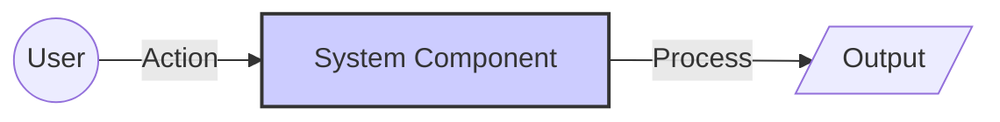

# 🛠️ Permissions-and-ACL

## 📄 Task Description
Write the task description here...

### Requirements:
1.  Requirement 1
2.  Requirement 2

---

## 🏗️ Architecture Diagram



## 🚀 Solution

### 1. Step One
Description of step one.

```bash
# Command here
```
