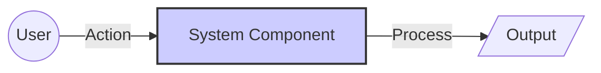

# 🛠️ User-Management

## 📄 Task Description
Create a user named 'sarah'.
Assign her to the 'devops' group.
Ensure she has sudo access without password.

### Requirements:
1.  Requirement 1
2.  Requirement 2

---

## 🏗️ Architecture Diagram



## 🚀 Solution

### 1. Step One
Description of step one.

```bash
# Command here
```
